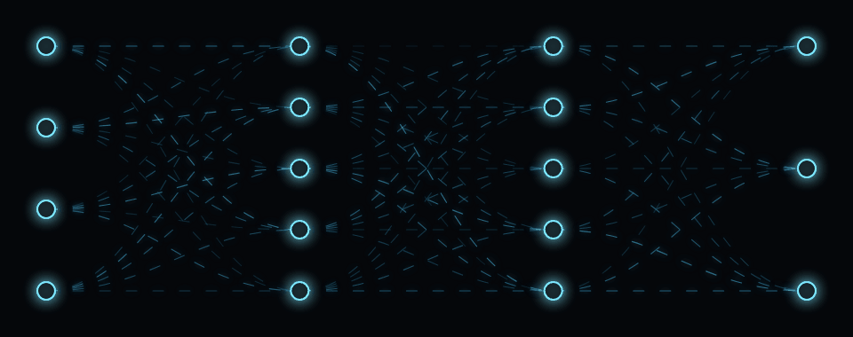

# Network Animator

Create glowing network diagrams with animated connections. Configure the layers, tune the appearance, then record the stage or export a still frame.

**[Open the live visualizer](https://programming-with-julius.github.io/network-animator/)**

## Features

- Configure fully connected layers with a comma-separated list, such as `4, 5, 5, 3`.
- Choose straight or curved connections and optional moving dashes.
- Customize backgrounds, node fills and outlines, edge colors, widths, and opacity.
- Adjust node and edge glow independently.
- Use seeded visual weights for stable edge opacity, or randomize them for a new look.
- Hide a subset of connections with edge dropout and set the rendering FPS.
- Highlight a node and its incident edges on hover, with optional `(layer, node)` labels.
- Export the current canvas frame as a PNG.

## Using it

1. Open the [live visualizer](https://programming-with-julius.github.io/network-animator/), or open [`index.html`](index.html) in a browser.
2. Enter **Layers (nodes per layer)** as comma-separated numbers.
3. Set **Stage height (vh)** and adjust the colors, padding, node sizes, edge styles, and glow controls below the canvas.
4. Toggle **Animated dashes**, **Curved edges**, and **Weight-based opacity** to choose the presentation you want.
5. Screen-record only the top stage, or select **Export PNG** for a still image. **Reset defaults** restores the starting configuration.

**Shortcuts:** `R` randomizes the visual weights; `Space` toggles dashed-edge animation. Hover over a node to highlight its incoming and outgoing connections.

## How it works

The canvas spaces nodes vertically within each layer and spreads the layers horizontally. Connections join every node to every node in the next layer; edge dropout can hide a subset. Curved connections use Bézier paths, and moving dash offsets create the animation.

Seeded random weights control the appearance of the edges. This is a diagram tool: it does not train a model or perform inference.

Everything lives in a single HTML file. There is no build step or application server; the editor styling loads Bootstrap from a CDN.

## Related tool

[`headline-animator`](https://github.com/Programming-with-Julius/headline-animator) cycles headlines while keeping a shared keyword centered.

## Project note and license

> Fully vibe-coded, does not reflect me as a developer.

MIT. See [`LICENSE`](LICENSE).
