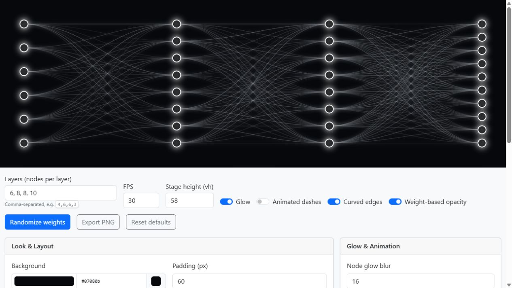

# Network Animator

A browser canvas tool for making glowing neural-network diagrams and animations. Configure the layers, tune the look, then record the stage or export a still frame.

**[Try the live visualizer](https://programming-with-julius.github.io/network-animator/)** · **[Watch the video](https://www.youtube.com/watch?v=qEwmR20Ss9Y)**

*A demo diagram with ten output nodes, echoing the ten digit classes in the video's MNIST experiment.*

## Made for the video

This visualizer belongs to the production tools for **[Neural Network in ChatGPT](https://www.youtube.com/watch?v=qEwmR20Ss9Y)** by Programming with Julius. The video asks whether ChatGPT can execute the mathematics of a neural network, rather than simply recognize an image itself.

The experiment trains a PyTorch convolutional model on MNIST handwritten digits and extracts the operations in its forward pass into mathematical expressions. A 28 × 28 image becomes 784 pixel values; the ten final outputs represent the digits 0–9. After splitting the arithmetic into smaller pieces, the video compares ChatGPT's predictions with PyTorch's.

This tool provides an illustrative network diagram for explaining layers and connections. Its seeded weights control the appearance of the edges; they are not the trained MNIST model's weights, and the diagram does not perform inference.

## What you can make

- Fully connected diagrams with any layer sizes entered as a comma-separated list, such as `6, 8, 8, 10`.
- Straight or curved connections, with optional animated dashes.
- Custom backgrounds, node fills and outlines, edge colors, widths, and opacity.
- Independent node and edge glow, plus seeded weight-based edge opacity.
- Sparser diagrams using edge dropout, with configurable FPS for recording.
- Node hover highlights and optional `(layer, node)` labels.
- A PNG export of the current canvas frame.

## Using it

1. Open the [live visualizer](https://programming-with-julius.github.io/network-animator/), or open [`index.html`](index.html) in a browser.
2. Enter **Layers (nodes per layer)** as comma-separated numbers.
3. Set **Stage height (vh)** and adjust the colors, padding, node sizes, edge styles, and glow controls below the canvas.
4. Toggle **Animated dashes**, **Curved edges**, and **Weight-based opacity** to choose the presentation you want.
5. Screen-record only the top stage, or select **Export PNG** for a still image. **Reset defaults** restores the starting configuration.

**Shortcuts:** `R` randomizes the visual weights; `Space` toggles dashed-edge animation. Hover over a node to highlight its incoming and outgoing connections.

There is no build step or application server. The implementation lives in a single HTML file; the editor styling uses Bootstrap from a CDN.

## How it works

Nodes are spaced vertically within each layer, and layers are spread horizontally across the canvas. Every node connects to every node in the next layer, unless edge dropout hides a subset of those connections. Curved edges use cubic Bézier paths.

A seeded random generator keeps visual weights stable across redraws. Weight magnitude can affect edge opacity, while the animation loop advances the dash offset at the selected speed and FPS. The hover renderer draws a selected node and its incident edges over the rest of the diagram.

## Companion tool

[`headline-animator`](https://github.com/Programming-with-Julius/headline-animator) creates the opening headline montage with a fixed keyword position.

## Project note and license

> Fully vibe-coded, does not reflect me as a developer.

MIT. See [`LICENSE`](LICENSE).
